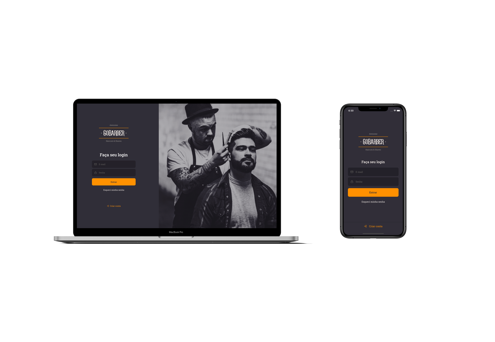

<h1 align="center">
	
</h1>

<p align="center">
    <a href="https://github.com/leeorf">
      
    </a>
    <a href="https://www.linkedin.com/in/leonardorodriguesf/">
      
    </a>
</p>

 

# :open_file_folder: Table of contents
- [About the project](#scissors-about-the-project)
- [About the repository](#question-about-the-repository)
- [Getting started](#computer-getting-started)
- [How to contribute](#metal-how-to-contribute)
- [Author](#information_desk_person-author)
- [License](#page_facing_up-license)

# :scissors: About the project
GoBarber is a service scheduling platform for barbershops.
The application is divided in 2 systems:
- **Web**: designed for the barbers. Here a barber can manage and track all appointments between the barber and its customers.
- **Mobile**: designed for the customers. Here customers have access to a list of barbers registered on the platform, and they can choose the best time to schedule an appointment with a specific barber.

# :question: About the repository

This repository is divided in 3 different folders, each one containing more details about the technologies that had been used.
- **Backend**: REST API built with Node.js and TypeScript. The API is responsible for the application CRUD, data persistent and to handle exceptions. The API feeds both the web frontend and mobile.</br>
Too see the **api**, click here: [GoBarber Backend](./backend).

-  **Frontend**: Web page built with ReactJS and TypeScript. The web page allows the barber to manage all scheduled services.</br>
Too see the **web client**, click here: [GoBarber Web](./frontend).</br>

- **Mobile**: Mobile app built with React Native and TypeScript. The app allows users to schedule services with barbers registered in the platform.</br>
*In Progress:* ~~Too see the **mobile client**, click here: [GoBarber Mobile](./mobile).~~

# :computer: Getting started

### Requirements

- [Git](https://git-scm.com) to clone the project.
- [Node.js](https://nodejs.org/en/) installed.
- [Yarn](https://classic.yarnpkg.com/lang/en/) or [npm](https://www.npmjs.com) to install packages.
- iOS or/and Android device or emulator.
- Database:
  - [PostgreSQL](https://www.postgresql.org) as a relational database.
  - [MongoDB](https://www.mongodb.com) as a non-relational database.
  - [Redis](https://redis.io) to use as a cache.

>Obs: I recommend to use [Docker](https://www.docker.com) to run PostgreSQL, MongoDB and Redis.

### Clone the project
``` bash
# Clone the project:
$ git clone https://github.com/leeorf/gobarber.git gobarber


# Go to the project directory:
$ cd gobarber
```

### Backend

To run the backend check the [Backend](./backend) folder.

### Frontend
- [ ] *In Progress*


### Mobile
- [ ] *In Progress*


# :metal: How to contribute
### Fork this repository

You can **Fork** using Github official command line or using the website (image below).


### After the fork, follow the steps below

```bash
# Clone the project to your own machine
$ git clone your-fork-url gobarber && cd gobarber


# Create a branch with your feature:
$ git checkout -b my-feature

# Commit changes to your own branch
$ git commit -m "My new feature"

# Push your work back up to your fork
$ git push origin my-feature
```

### Submit

After following all the previous steps, you can submit a **Pull request** so that we can review your changes.


After your pull request is merged, you can delete your branch.

# :information_desk_person: Author

**Leonardo Rodrigues**

*Let's connect!* 
[](https://github.com/leeorf)
[](https://www.linkedin.com/in/leonardorodriguesf/)

# :page_facing_up: License
This project is licensed under the MIT License - see the [LICENSE](./LICENSE) file for details.


---

*This project was developed by [Rocketseat](https://github.com/Rocketseat) during the GoStack Bootcamp*
